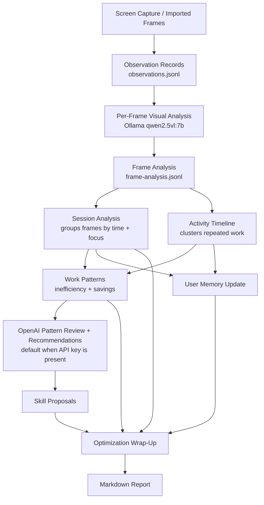
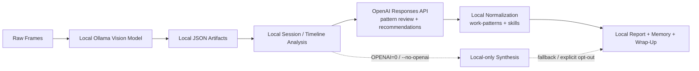
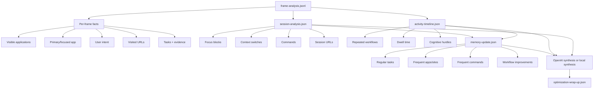
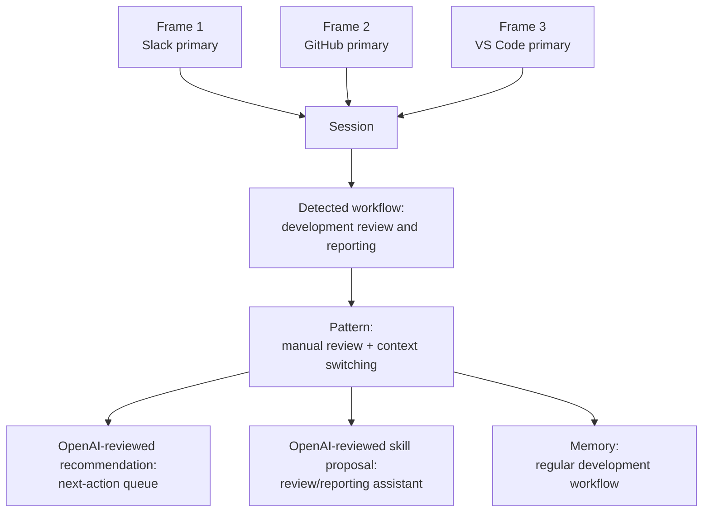
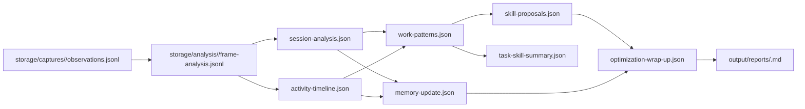
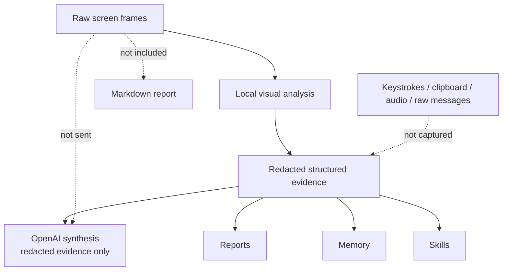

# Lucille Architecture Analysis

Lucille is a local-first screen-to-analysis pipeline. The important idea is that it has two layers:

1. Frame intelligence: what is visible in each individual frame.
2. Interconnected intelligence: how frames connect into sessions, repeated workflows, memory, skills, and wrap-up recommendations.

## System Overview

## Local vs OpenAI

Per-frame vision remains local. Pattern review and recommendations use OpenAI by default when `OPENAI_API_KEY` is available.

OpenAI receives local timeline/common-task summaries plus representative redacted frame evidence only. Full per-frame analysis remains local, and raw screenshots are not sent to OpenAI. Use `OPENAI=0` or `--no-openai` to force local-only synthesis.

## Core Data Flow

## Interconnected Analysis

The interconnected layer does not re-look at pixels. It works over the structured per-frame output.

## Generated Artifacts

## Privacy Boundary

## Summary

Lucille uses local frame analysis to understand each screenshot, then connects those frames into sessions and repeated workflows. By default, when an OpenAI API key is available, the pattern review, recommendations, and skill portfolio are synthesized through OpenAI from redacted structured evidence only. The resulting work patterns, memory updates, skills, and wrap-up report are normalized and stored locally.
